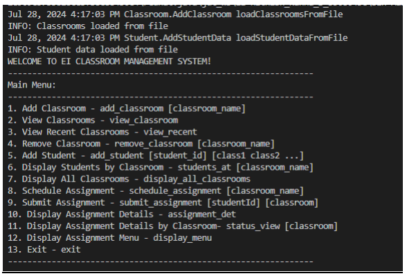
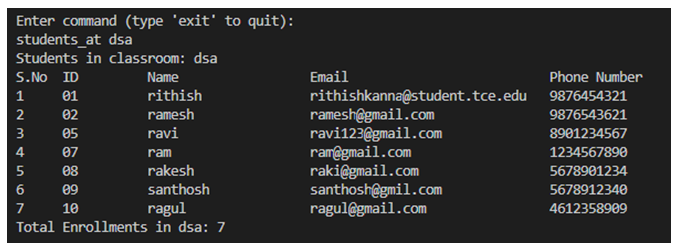

# 21H040_EI_Coding_Exercises

## Exercise 1 - Design Pattern Usage

### 1. Creational Patterns

**Factory Design Pattern**
- **Use Case:** Payment Gateway
- **Description:** Processes payments via Credit Card, PayPal, and Bitcoin. Utilizes the Factory Method pattern to create instances of payment processors based on the user's choice, allowing for easy future extensions.The Sample Output is Shown Below.

**Singleton Design Pattern**
- **Use Case:** User Authentication
- **Description:** Manages user login and signup processes with a single instance to ensure consistency and efficiency in handling user data.The Sample Output is Shown Below.

### 2. Structural Patterns

**Composite Design Pattern**
- **Use Case:** Playlist Management System
- **Description:** Manages playlists containing both individual songs and nested playlists using the Composite pattern. Supports adding songs, creating playlists, and navigating through them with action logging.The Sample Output is Shown Below.

**Decorator Design Pattern**
- **Use Case:** E-commerce Billing System
- **Description:** Applies dynamic pricing adjustments, such as discounts, taxes, and promotions, using the Decorator Pattern for flexible and extendable pricing strategies.The Sample Output is Shown Below.

### 3. Behavioral Patterns

**Command Pattern**
- **Use Case:** Home Automation System
- **Description:** Controls devices like lights, thermostats, and door locks. Allows users to execute commands to change device states and prints the current state before exiting.The Sample Output is Shown Below.

**Observer Design Pattern**
- **Use Case:** Smart Agriculture System
- **Description:** Optimizes crop growth by integrating environmental sensors and farming equipment. Automatically triggers irrigation and fertilization based on soil conditions, promoting sustainable farming practices.The Sample Output is Shown Below.

## Exercise 2 - Virtual Classroom Manager

### Description

The Virtual Classroom Manager is a comprehensive Java-based application developed to streamline the management of classrooms, students, and assignments. It offers functionalities such as adding and viewing classrooms, enrolling students in classrooms, scheduling assignments, and displaying assignment details. The application is built following established design patterns and SOLID principles, ensuring high maintainability and ease of debugging through effective logging mechanisms. By preventing duplication of classrooms and assigning unique IDs to students, the Virtual Classroom Manager enhances organization and efficiency in educational environments.

### Sample Input and Outputs

